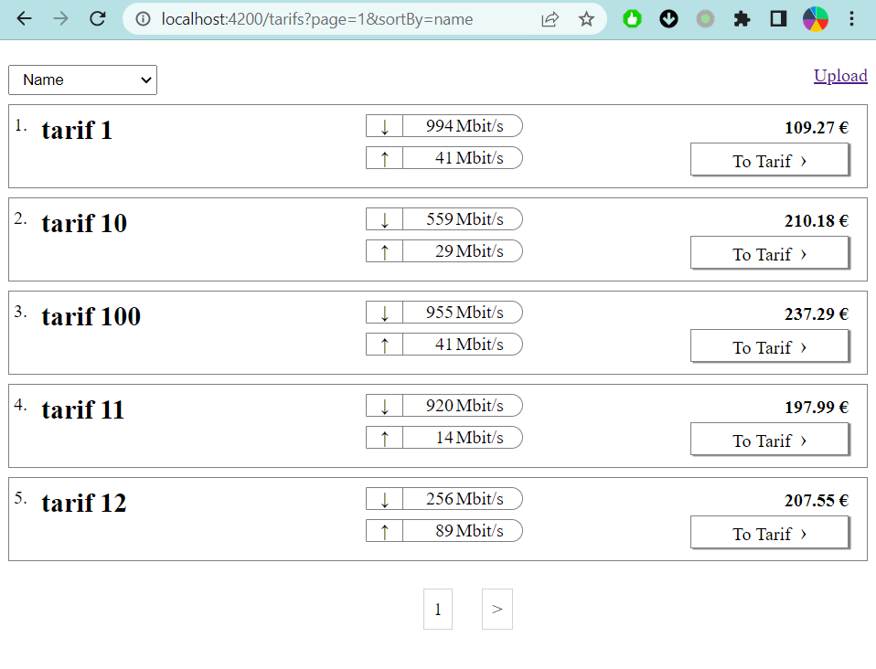
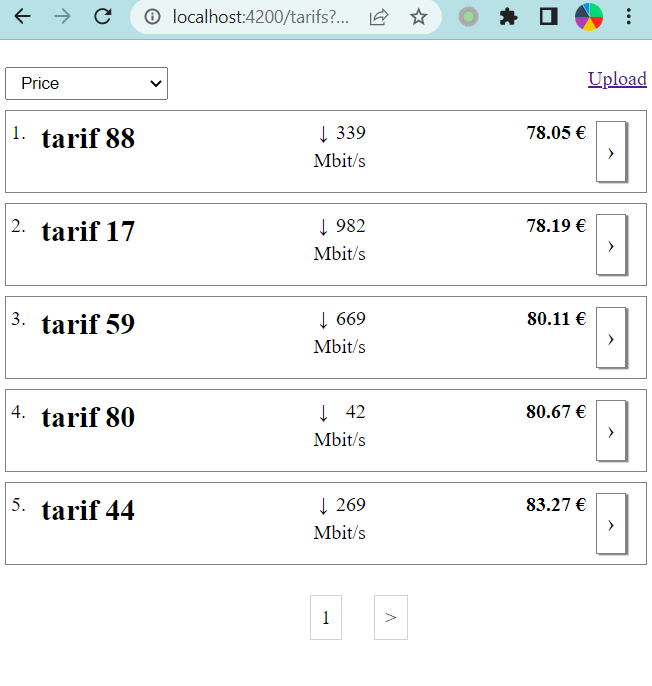
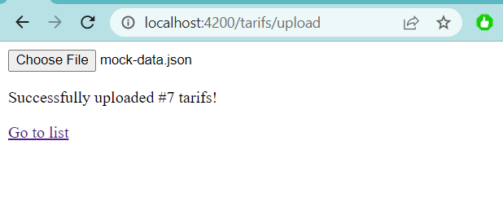

# Verivox frontend challenge

### Changelog

#### 27.01.2023

- added 100 mocked items and pagination
- better typings for sort-by
- added track-by for the list
- preserve scroll position on route change
- added some aria-label for a11y

also

- added upload file functionality to set the list of tarifs! Not sure if that was what requested.
- added zod to validate the json file!

### Screenshots

| First Header                     | Second Header                    |
| -------------------------------- | -------------------------------- |
|  |  |
|  |                                  |

Tried to have few small commits this time.

Thanks for reviewing the code.

Yasser Zadeh
